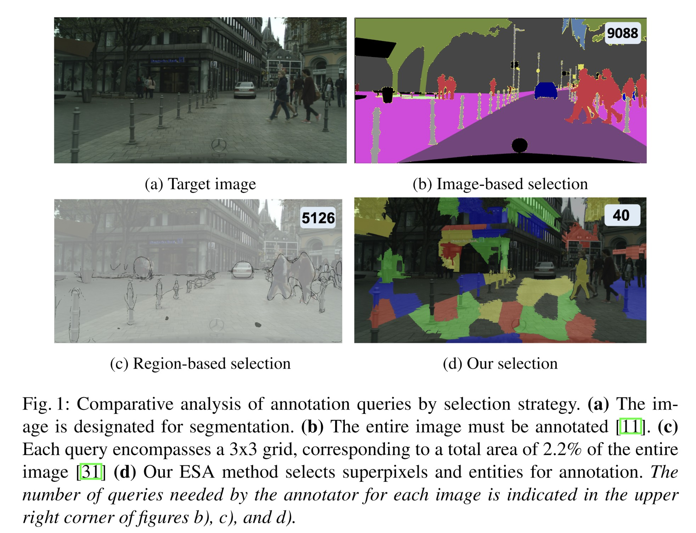
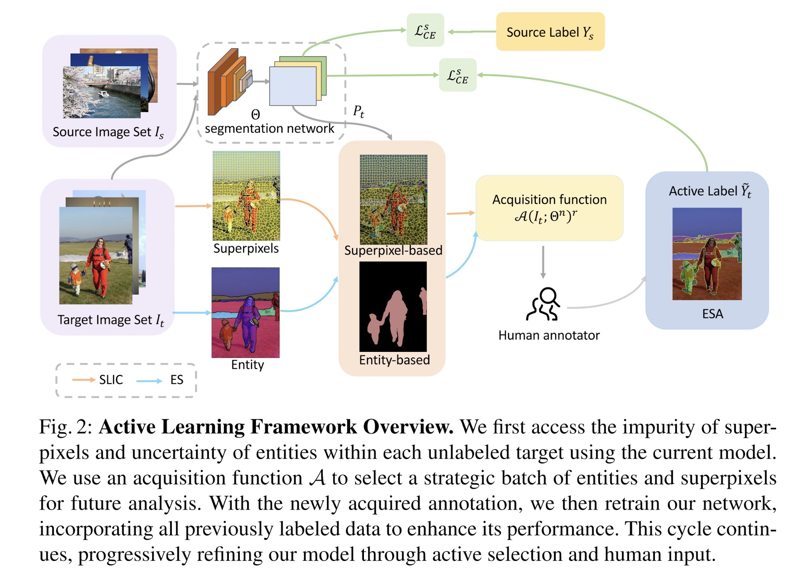

# ESA: Annotation-Efficient Active Learning for Semantic Segmentation

[Jinchao Ge](https://github.com/jinchaogjc), [Zeyu Zhang](https://steve-zeyu-zhang.github.io/), [Minh Hieu Phan](https://scholar.google.com/citations?user=gSEw8EsAAAAJ&hl=en), [Bowen Zhang](https://www.linkedin.com/in/bowen-zhang-a7403095/), [Akide Liu](https://www.linkedin.com/in/akideliu/), [Yang Zhao](https://yangyangkiki.github.io/)*

*Corresponding author: y.zhao2@latrobe.edu.au 

[**[Arxiv]**]()

## Abstract
Active learning enhances annotation efficiency by selecting the most revealing samples for labeling, thereby reducing reliance on extensive human input. Previous methods in semantic segmentation have centered on individual pixels or small areas, neglecting the rich patterns in natural images and the power of advanced pre-trained models. To address these challenges, we propose three key contributions: Firstly, we introduce Entity-Superpixel Annotation (ESA), an innovative and efficient active learning strategy which utilizes a class-agnostic mask proposal network coupled with super-pixel grouping to capture local structural cues. Additionally, our method selects a subset of entities within each image of the target domain, prioritizing superpixels with high entropy to ensure comprehensive representation. Simultaneously, it focuses on a limited number of key entities, thereby optimizing for efficiency. By utilizing an annotator-friendly design that capitalizes on the inherent structure of images, our approach significantly outperforms existing pixel-based methods, achieving superior results with minimal queries, specifically reducing click cost by 98% and enhancing performance by 1.71%. For instance, our technique requires a mere 40 clicks for annotation, a stark contrast to the 5000 clicks demanded by conventional methods.

