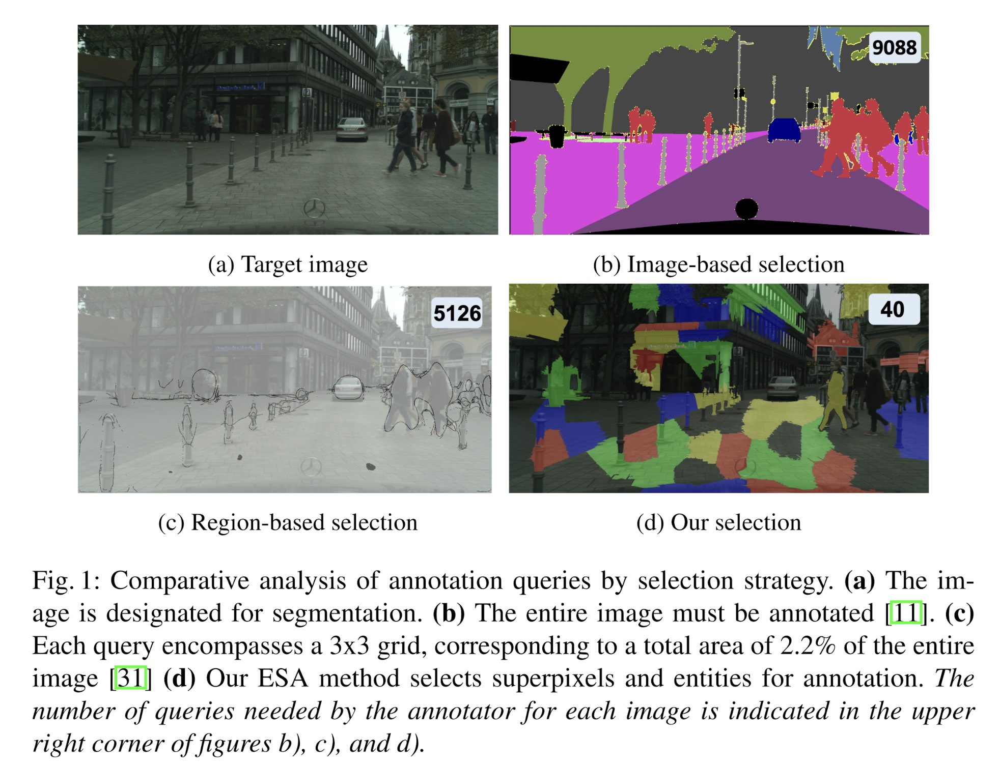
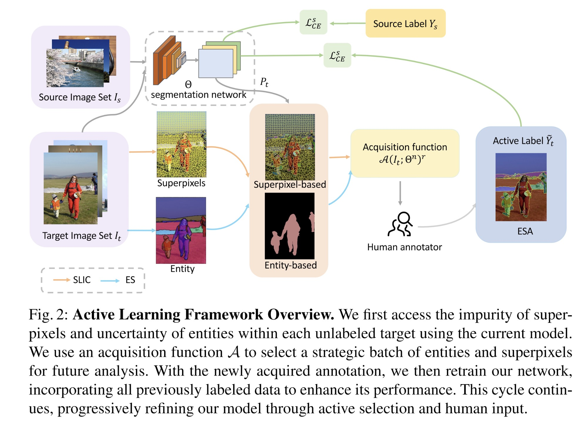

 ---

<div align="center">    

# ESA: Annotation-Efficient Active Learning for Semantic Segmentation

[Jinchao Ge](https://github.com/jinchaogjc), [Zeyu Zhang](https://steve-zeyu-zhang.github.io/), [Minh Hieu Phan](https://scholar.google.com/citations?user=gSEw8EsAAAAJ&hl=en), [Bowen Zhang](https://www.linkedin.com/in/bowen-zhang-a7403095/), [Akide Liu](https://www.linkedin.com/in/akideliu/), [Shuwen Zhao](https://github.com/Dooonut), [Yang Zhao](https://yangyangkiki.github.io/)*

*Corresponding author: y.zhao2@latrobe.edu.au 

<em><b>ICIC 2025 Oral</b></em>

[[**Paper Link**]](https://arxiv.org/abs/2408.13491) [[Papers with Code]](https://paperswithcode.com/paper/esa-annotation-efficient-active-learning-for)

## Abstract
Active learning enhances annotation efficiency by selecting the most revealing samples for labeling, thereby reducing reliance on extensive human input. Previous methods in semantic segmentation have centered on individual pixels or small areas, neglecting the rich patterns in natural images and the power of advanced pre-trained models. To address these challenges, we propose three key contributions: Firstly, we introduce **Entity-Superpixel Annotation (ESA)**, an innovative and efficient active learning strategy which utilizes a class-agnostic mask proposal network coupled with super-pixel grouping to capture local structural cues. Additionally, our method selects a subset of entities within each image of the target domain, prioritizing superpixels with high entropy to ensure comprehensive representation. Simultaneously, it focuses on a limited number of key entities, thereby optimizing for efficiency. By utilizing an annotator-friendly design that capitalizes on the inherent structure of images, our approach significantly outperforms existing pixel-based methods, achieving superior results with minimal queries, specifically reducing click cost by **98%** and enhancing performance by **1.71%**. For instance, our technique requires a mere 40 clicks for annotation, a stark contrast to the 5000 clicks demanded by conventional methods.






</div>

## Usage
### Prerequisites
- Python 3.8
- Pytorch 2.0.0
- torchvision 0.15.0

Step-by-step installation

```bash
conda create --name esa -y python=3.8
conda activate esa

# this installs the right pip and dependencies for the fresh python
conda install -y ipython pip


pip install -f https://download.pytorch.org/whl/torch_stable.html torch==2.0.0+cu118 torchvision==0.15.0
conda install -c "nvidia/label/cuda-11.8.0" cuda-toolkit
pip install -r requirements.txt
mkdir results
```

### Data Preparation

Symlink the required dataset

```bash
ln -s /path_to_coco_dataset data/coco
ln -s /path_to_voc_dataset data/voc
```

Generate the label static files for COCO Datasets by running

```bash
python datasets/generate_coco_label_info.py -d datasets/coco -o datasets/coco/
```

The data folder should be structured as follows:

```
Data
|-- COCO
|   |-- annotations
|   |-- images
|   |   `-- train2017 -> ../train2017/
|   `-- train2017
|-- VOCdevkit
|   `-- VOC2012
|       |-- JPEGImages
|       |-- SegmentationClass
|       |-- SegmentationClassAug
|       |-- SegmentationClassAug_es

```

### ESA Training

We provide the training scripts in `tools/train.sh` using a single GPU.

```bash
# training for COCO to VOC
export CUDA_VISIBLE_DEVICES=0
export output=results/deeplabv3plus_r101_cocovoc_PA_40_d0
python train_coco.py -cfg configs/coco2voc/deeplabv3plus_r101_cocovoc_PA_40_d0.yaml OUTPUT_DIR $output
```

### ESA Resume
We provide the code for resuming.

```bash
# resume
python train.py -cfg configs/coco2voc/deeplabv3plus_r101_cocovoc_PA_40_d0.yaml resume results/deeplabv3plus_r101_cocovoc_PA_40_d0/model_iter040000.pth OUTPUT_DIR test_cocovoc_PA_40_output.txt 
```


### ESA Testing
To evaluate ESA, use the following command:
```bash
# testing
export checkpoint=results/deeplabv3plus_r101_cocovoc_PA_40_d0/model_iter040000.pth
python test.py -cfg configs/coco2voc/deeplabv3plus_r101_cocovoc_PA_40_d0.yaml resume $checkpoint OUTPUT_DIR $output > ${output}.txt
```


## Acknowledgements
This project is based on the following open-source projects: [RIPU](https://github.com/BIT-DA/RIPU). We thank their authors for making the source code publically available.


## Citation

For academic use, please cite:
```
@article{ge2024esa,
  title={ESA: Annotation-Efficient Active Learning for Semantic Segmentation},
  author={Ge, Jinchao and Zhang, Zeyu and Phan, Minh Hieu and Zhang, Bowen and Liu, Akide and Zhao, Yang},
  journal={arXiv preprint arXiv:2408.13491},
  year={2024}
}
```
```

## Contact

If you have any problem about our code, feel free to contact

- [jinchao.ge@adelaide.edu.au](mailto:jinchao.ge@adelaide.edu.au)

or describe your problem in Issues.
